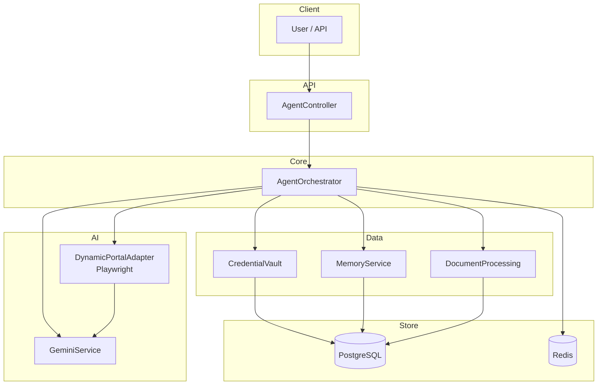

# BrowserAI Agent — Architecture & Diagrams

One-page reference for architecture and flow. Use with [INTERVIEW_PREP.md](INTERVIEW_PREP.md) for interviews.

---

## System Architecture (Mermaid)



---

## Request Flow (21 Steps)

```
1. Rate limit (Redis) → 2. Create session (PostgreSQL, FSM) → 3. Intent (Gemini or Redis cache)
→ 4. FSM validate → 5. Portal URL (SerpAPI if needed) → 6. Redis lock
→ 7. Workflow cache (PostgreSQL) → 8. Pre-dedup by reference (PostgreSQL)
→ 9. Credentials (PostgreSQL, decrypt AES-256) → 10. Playwright launch
→ 11. DOM loop: get DOM → Gemini → action → execute (repeat)
→ 12. CAPTCHA: Gemini Vision or Redis + user API
→ 13. OTP: Redis poll until user POST /api/otp
→ 14. Download file → 15. SHA-256, dedup, store (PostgreSQL)
→ 16. Copy to ~/Downloads → 17. PDF extraction (PDFBox + Gemini)
→ 18. Save workflow (PostgreSQL) → 19. Audit log → 20. Release lock → 21. Return response
```

---

## Tech Stack at a Glance

| Layer | Technology |
|-------|------------|
| API | Spring Boot 3, Java 17 |
| AI | Google Gemini 2.0 Flash |
| Browser | Playwright (Chromium) |
| DB | PostgreSQL 16 |
| Cache / Lock / Rate limit | Redis 7 |
| Resilience | Resilience4j |
| PDF | Apache PDFBox |
| Search | SerpAPI |
| Security | AES-256-GCM (credentials) |
| Deploy | Docker, Docker Compose |

---

## FSM States

```
INIT → NEED_PORTAL | NEED_CREDENTIAL | NEED_REFERENCE | EXECUTION_READY
EXECUTION_READY → EXECUTION_RUNNING
EXECUTION_RUNNING → CAPTCHA_DETECTED | OTP_REQUIRED | SUCCESS | FAILURE
CAPTCHA_DETECTED → EXECUTION_RUNNING | FAILURE
OTP_REQUIRED → EXECUTION_RUNNING | FAILURE
```

---

## ASCII Architecture (if Mermaid doesn’t render)

```
                    ┌─────────────┐
                    │   Client    │
                    └──────┬──────┘
                           │
                    ┌──────▼──────┐
                    │ Controller  │
                    └──────┬──────┘
                           │
    ┌──────────────────────▼──────────────────────┐
    │           AgentOrchestrator                  │
    │  (rate limit → session → intent → FSM →       │
    │   lock → memory → creds → portal → doc)      │
    └──┬────────┬────────┬────────┬────────┬──────┘
       │        │        │        │        │
       ▼        ▼        ▼        ▼        ▼
    ┌──────┐ ┌──────┐ ┌──────┐ ┌──────┐ ┌──────────┐
    │Gemini│ │Vault │ │Memory│ │Portal│ │DocProc   │
    │      │ │AES256│ │Workflow│ │Playwright│ │Hash,Dedup│
    └──┬───┘ └──┬───┘ └──┬───┘ └──┬───┘ └────┬────┘
       │        │        │        │          │
       └────────┴────────┴────────┴──────────┘
                           │
              ┌────────────┴────────────┐
              ▼                         ▼
        ┌──────────┐              ┌──────────┐
        │PostgreSQL│              │  Redis   │
        └──────────┘              └──────────┘
```

---

For full interview script, Q&A, and design decisions, see **INTERVIEW_PREP.md**.
