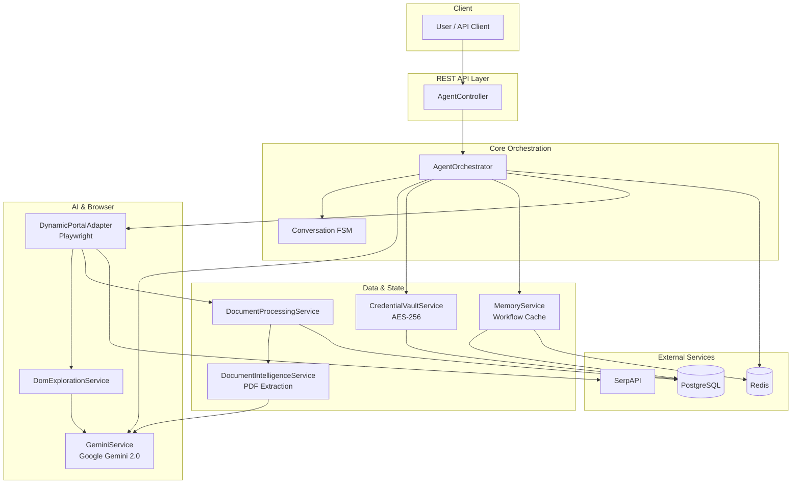
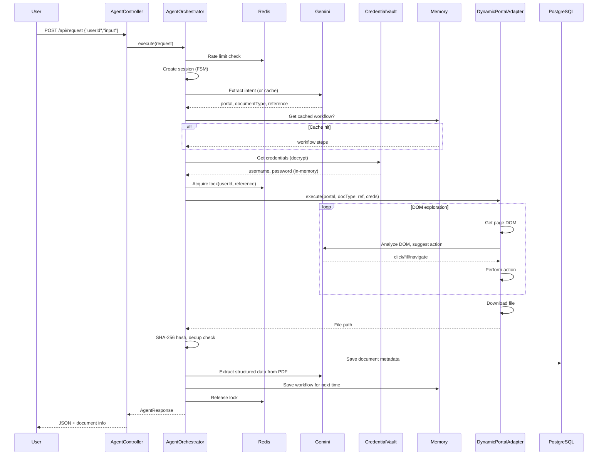
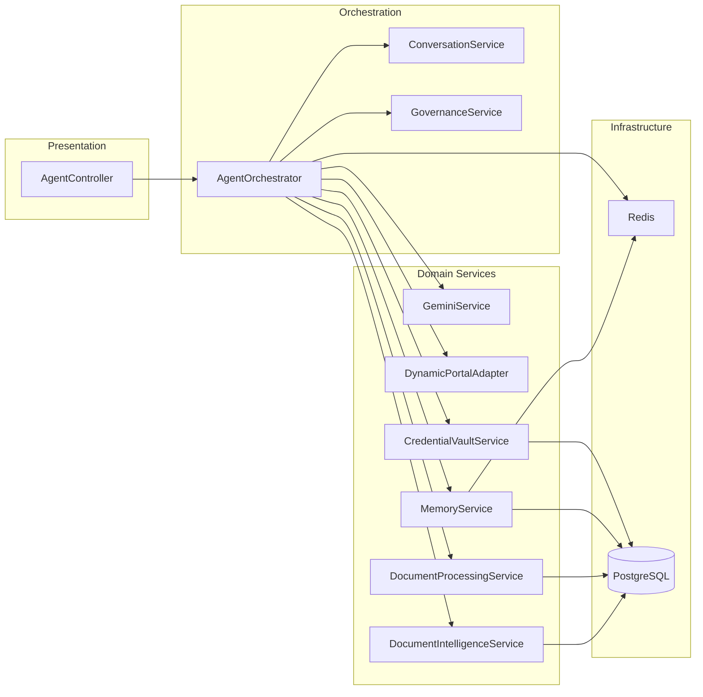
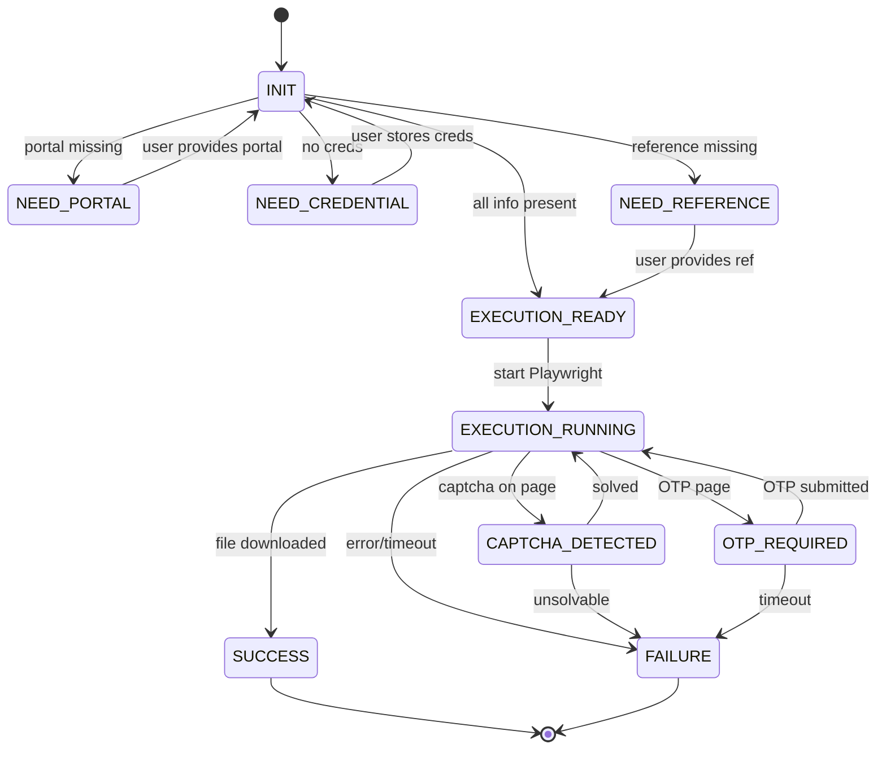

# BrowserAI Agent — Interview Preparation Guide

Use this document to explain the project confidently in interviews. It is **end-to-end sufficient** to cover:
- **Kya use kiya** — har technology/component
- **Kaise use kiya** — flow, integration, code-level
- **Kyu use kiya** — design decisions and trade-offs
- **Cross-questions** — follow-up questions an interviewer can ask, with answers

**Quick navigation:**
- **Section 1–2:** Elevator pitch, problem/solution
- **Section 3–4:** Architecture diagrams, end-to-end flow (21 steps)
- **Section 5–6:** Tech stack, component responsibility
- **Section 7–8:** Design decisions, challenges & solutions
- **Section 9:** Sample Q&A (first-level answers)
- **Section 10:** How to present (opening → closing)
- **Section 11:** File → responsibility
- **Section 12:** **What / How / Why** for each major choice (Gemini, Playwright, PostgreSQL, Redis, FSM, workflow cache, credentials, dedup, Resilience4j, SerpAPI)
- **Section 13:** **Cross-questions** — deep follow-ups (Playwright vs Selenium, workflow in DB vs Redis, UI change, DOM size, infinite loop, concurrency, security, Redis down, scaling, testing, TTL, OTP detection, scheduler)
- **Section 14:** **Sufficiency checklist** — verify you can answer what/how/why for every topic

---

## 1. Elevator Pitch (30–60 seconds)

> "I built an **AI-powered browser automation agent** that downloads documents from **any website** using **natural language**.  
>  
> Instead of writing separate scripts for each portal—IndiGo, banks, government sites—you just say: *'Download my IndiGo invoice for PNR ABC123.'* The system uses **Google Gemini** to understand intent, **Playwright** to control the browser, and **learns the navigation path** so the next time it can replay the same flow with **zero LLM calls**.  
>  
> It handles **logins, OTPs, CAPTCHAs**, stores credentials **encrypted**, and extracts **structured data from PDFs**. The whole stack is **Spring Boot, PostgreSQL, Redis**, with **Resilience4j** for reliability. I designed it so that **no portal-specific code** is needed—it works with any website dynamically."

---

## 2. Problem & Solution

| Problem | Solution |
|--------|----------|
| Every portal has different UI, forms, and flows | LLM-guided DOM exploration — AI reads the page and decides what to click/fill |
| Writing and maintaining scripts per portal is costly | Zero hardcoding: one adapter (DynamicPortalAdapter) works for all portals |
| LLM calls are expensive and slow | Workflow learning: cache successful paths in DB, replay next time (0 tokens) |
| Users have to handle OTP/CAPTCHA manually | OTP via API; CAPTCHA: AI (Gemini Vision) first, manual fallback via API |
| Credentials must be safe | AES-256-GCM vault; decrypted only in-memory, never sent to LLM |
| Duplicate downloads | Dual dedup: by reference before run, by SHA-256 hash after download |
| No visibility into what happened | Full audit trail + request tracking + token usage per session |

---

## 3. Architecture Diagram

### 3.1 High-Level System Architecture

### 3.2 Request Flow (Sequence)

### 3.3 Component Layering

### 3.4 FSM States (Conversation Flow)

---

## 4. End-to-End Request Flow (Step by Step)

When a user sends **"Download my IndiGo invoice for PNR ABC123"**:

| Step | Where | What happens | Technology |
|------|--------|----------------|------------|
| 1 | RateLimiterService | Check if user is within 10/min, 60/hour | Redis (sliding window) |
| 2 | ConversationService | Create or resume conversation session | PostgreSQL (conversation_sessions), FSM |
| 3 | GeminiService | Extract intent from natural language | **Google Gemini** (REST API), cache in Redis (6h TTL) |
| 4 | AgentOrchestrator | FSM validation: portal, credentials, reference | ConversationState enum |
| 5 | WebSearchService (optional) | Find portal login URL if unknown | **SerpAPI** |
| 6 | RedisLockService | Acquire lock(userId, reference) to avoid duplicate run | **Redis** |
| 7 | MemoryService | Check for cached workflow (portal + documentType) | **PostgreSQL** (portal_workflows) |
| 8 | DocumentProcessingService | Pre-execution dedup: same reference + type already downloaded? | **PostgreSQL** (documents) |
| 9 | CredentialVaultService | Get credentials for portal (decrypt in memory) | **PostgreSQL** (credentials), **AES-256-GCM** |
| 10 | DynamicPortalAdapter | Launch Chromium, go to portal URL | **Playwright** |
| 11 | DomExplorationService + Gemini | Get DOM → send to Gemini → get action (click/fill) → execute | **Gemini**, **Playwright** |
| 12 | DynamicPortalAdapter | If CAPTCHA: try Gemini Vision; else store image in Redis, wait for user API | **Gemini**, **Redis** |
| 13 | DynamicPortalAdapter | If OTP: wait for user to POST /api/otp (Redis poll, 2 min timeout) | **Redis** |
| 14 | DynamicPortalAdapter | Navigate to document, trigger download, wait for file | **Playwright** (download event) |
| 15 | DocumentProcessingService | Compute SHA-256, check hash dedup, save file to storage | **Java**, **PostgreSQL** |
| 16 | FileStorageService | Copy file to user's Downloads folder | **Java NIO** |
| 17 | DocumentIntelligenceService | Extract text from PDF → send to Gemini → structured JSON | **PDFBox**, **Gemini** |
| 18 | MemoryService | Save workflow steps to portal_workflows for replay | **PostgreSQL** |
| 19 | AuditService | Log every step with duration | **PostgreSQL** (audit_logs) |
| 20 | RedisLockService | Release lock | **Redis** |
| 21 | AgentController | Return AgentResponse with document info, download URL, extracted data | **Spring MVC** |

---

## 5. Technology Stack — Where & Why

| Technology | Where used | Why |
|------------|------------|-----|
| **Spring Boot 3** | Entire backend | REST API, DI, configuration, production-ready |
| **Java 17** | Codebase | LTS, records, pattern matching |
| **Google Gemini 2.0 Flash** | Intent extraction, DOM analysis, PDF extraction, CAPTCHA solving | Fast, multimodal, good for structured JSON output |
| **Playwright** | Browser automation | Cross-browser, stable API, download handling, headless |
| **PostgreSQL** | Documents, credentials, sessions, workflows, audit, token usage, scheduled tasks | Relational model, ACID, indexes |
| **Redis** | Rate limit, intent cache, distributed lock, OTP/CAPTCHA state | Fast, TTL, single-threaded consistency |
| **SerpAPI** | Portal URL discovery | When portal URL is not in memory, search by name |
| **Resilience4j** | Circuit breaker around Gemini, retry for portal calls | Avoid cascade failures, handle transient errors |
| **Apache PDFBox** | Extract text from PDFs | Document intelligence input |
| **AES-256-GCM** | Credential storage | Encrypt at rest, IV per encryption |
| **Docker & Docker Compose** | Run app + Postgres + Redis | One-command setup |
| **Spring Security** | Stateless API (configurable) | Ready for JWT/CORS in production |
| **Spring Data JPA** | All DB access | Repositories, transactions |
| **Lombok** | DTOs, entities | Less boilerplate |
| **Jackson** | JSON (request/response, Gemini payloads) | Standard in Spring |

---

## 6. Key Components (One-Liner Each)

| Component | Responsibility |
|-----------|----------------|
| **AgentController** | REST endpoints; delegates to orchestrator |
| **AgentOrchestrator** | Main pipeline: rate limit → session → intent → FSM → lock → memory → creds → portal → document → audit |
| **ConversationService** | FSM state transitions, session CRUD |
| **GeminiService** | Call Gemini API for intent, DOM analysis, PDF extraction; circuit breaker |
| **DynamicPortalAdapter** | Playwright automation; DOM exploration loop; OTP/CAPTCHA handling; workflow replay |
| **DomExplorationService** | Build DOM summary, parse Gemini’s action JSON, map to Playwright calls |
| **CredentialVaultService** | Store/retrieve encrypted credentials (AES-256-GCM) |
| **MemoryService** | Get/save portal workflows; build context for Gemini from past sessions |
| **DocumentProcessingService** | Hash, dedup (reference + hash), save file, link to DB |
| **DocumentIntelligenceService** | PDF text (PDFBox) → Gemini → structured JSON → store |
| **GovernanceService** | Enforce max LLM calls, tokens, exploration depth, session duration |
| **RateLimiterService** | Per-user sliding window (Redis) |
| **RedisLockService** | Acquire/release lock by userId + reference |
| **AuditService** | Append to audit_logs for every major step |
| **CaptchaSolverService** | AI solve (Gemini Vision) or store image for manual solve |
| **OtpService** | Store OTP in Redis; adapter polls until submitted or timeout |
| **WebSearchService** | SerpAPI search for portal URL |
| **SchedulerService** | Cron + one-time tasks (e.g. auto check-in 24h before flight) |

---

## 7. Design Decisions (Interview Talking Points)

1. **Why FSM for conversation?**  
   So we can pause and ask for missing data (portal, credentials, reference) and resume in the same session without re-parsing.

2. **Why cache intent in Redis?**  
   Same or similar query within 6 hours → no Gemini call → lower cost and latency.

3. **Why cache workflows in PostgreSQL?**  
   Replaying a known path uses no LLM tokens; only when the page structure changes do we fall back to exploration.

4. **Why Redis for lock?**  
   Single deployment: one Redis; atomic acquire/release so the same user + reference doesn’t run twice.

5. **Why never send credentials to the LLM?**  
   Security: only decrypt in our process and pass to Playwright; prompts never contain passwords.

6. **Why two-level dedup?**  
   Reference match avoids re-running automation; hash match avoids storing duplicate files from different runs.

7. **Why Resilience4j?**  
   Gemini or a portal can be slow/failing; circuit breaker and retries keep the system stable.

---

## 8. Challenges & How You Solved Them

| Challenge | Solution |
|-----------|----------|
| Every portal is different | Single DynamicPortalAdapter + LLM-guided DOM exploration; no portal-specific code |
| LLM cost and latency | Intent cache (Redis) + workflow cache (DB); replay with 0 Gemini calls when possible |
| CAPTCHA blocking automation | Try Gemini Vision first; if not solved, put image in Redis and expose GET /api/captcha/{userId} for manual solve |
| OTP during login | Adapter detects OTP page, stores session key in Redis; user calls POST /api/otp; adapter polls Redis until OTP or timeout |
| Infinite loops in exploration | Governance: max steps, max LLM calls, max session time; loop detection in exploration |
| Credentials safe at rest | AES-256-GCM with 32-byte secret from env; random IV per encrypt |
| Duplicate downloads | Pre-dedup by (userId, portal, documentType, reference); post-dedup by SHA-256 hash |
| Tracking what happened | audit_logs per step; request_id and session_id in responses; token_usage table |

---

## 9. Sample Interview Q&A

**Q: Explain the project in 2 minutes.**  
Use the **Elevator Pitch** (Section 1) and add: "The flow is: user sends natural language → we extract intent with Gemini → check cache → get credentials from vault → run Playwright with LLM-guided DOM exploration → download file → hash and dedup → extract PDF data → cache workflow for next time."

**Q: What is the role of the orchestrator?**  
"The AgentOrchestrator is the central pipeline. It does rate limiting, creates the conversation session, calls Gemini for intent (or uses cache), validates via FSM, acquires a Redis lock, checks workflow memory and pre-execution dedup, gets credentials, calls the portal adapter (Playwright), then does document processing, dedup, PDF extraction, workflow save, audit logging, and lock release. So it never does DOM or browser itself—it coordinates all services."

**Q: How do you support any portal without hardcoding?**  
"We use one adapter, DynamicPortalAdapter, with Playwright. We get the page DOM, send a summary to Gemini with the user’s goal, and Gemini returns the next action (e.g. click selector X, fill input Y). We execute that, get the new DOM, and repeat. Once a path works, we store it in portal_workflows and next time we replay that path without calling the LLM."

**Q: How do you handle OTP and CAPTCHA?**  
"OTP: when we detect an OTP page we put a key in Redis and block. We expose POST /api/otp; when the user submits OTP we write it to Redis. The browser thread polls Redis until it gets the OTP or a 2-minute timeout. CAPTCHA: we first try to solve with Gemini Vision. If that fails we store the CAPTCHA image in Redis and return; user can GET the image and POST the answer via /api/captcha."

**Q: How is security handled for credentials?**  
"Credentials are stored in PostgreSQL encrypted with AES-256-GCM. We use a 32-byte secret from an env variable and a random IV per encryption. We decrypt only inside our process when we need to fill the form and never put them in prompts or logs. LogMaskingUtil masks passwords and emails in logs."

**Q: What is the FSM for?**  
"The conversation FSM tracks whether we have enough to run: portal, credentials, reference. If something is missing we transition to NEED_PORTAL, NEED_CREDENTIAL, or NEED_REFERENCE and return a message to the user. When the user provides the missing piece in the next request we resume the same session and move to EXECUTION_READY, then EXECUTION_RUNNING, and finally SUCCESS or FAILURE. We also have CAPTCHA_DETECTED and OTP_REQUIRED for mid-flow user input."

**Q: Why Redis and PostgreSQL both?**  
"PostgreSQL is for durable data: documents, credentials, workflows, audit, token usage. Redis is for ephemeral and coordination: rate limit counters, intent cache (6h TTL), lock (per run), OTP/CAPTCHA state. So Redis = fast, TTL, locks; PostgreSQL = persistent, queryable."

**Q: How do you prevent runaway LLM usage?**  
"GovernanceService enforces max LLM calls per session (e.g. 25), max tokens (e.g. 100K), max exploration depth, and max session duration. Before each Gemini call we check these. We also cache intent and workflows so repeat requests use no or few LLM calls."

---

## 10. How to Present in the Interview

1. **Opening:**  
   "I’ll walk you through an AI browser automation project I built: what problem it solves, the high-level architecture, and the main flow."

2. **Problem (30 sec):**  
   "Downloading documents from different portals usually needs separate scripts. I wanted one system that works with any portal using natural language."

3. **Approach (30 sec):**  
   "User sends a sentence; we use Gemini to get intent. We check if we’ve already learned this portal’s flow; if yes we replay it with no LLM. If not, we drive the browser with Playwright and let Gemini decide each step from the DOM. We store that path for next time."

4. **Architecture (1 min):**  
   Show **Section 3.1** diagram (or draw on whiteboard): Client → Controller → Orchestrator → Gemini + Credential Vault + Memory + DynamicPortalAdapter → PostgreSQL + Redis. Mention FSM for conversation and workflow cache for cost control.

5. **Flow (1 min):**  
   "Request comes in → rate limit → create session → extract intent (or cache) → FSM check → lock → get credentials → run Playwright with DOM loop → download → hash, dedup, store → extract PDF data → save workflow → release lock → return response."

6. **Tech stack (30 sec):**  
   "Spring Boot for API and orchestration, Gemini for intent and DOM analysis, Playwright for browser, PostgreSQL for persistent data, Redis for rate limit, cache, and locks. Resilience4j for circuit breaker and retries, AES-256 for credential encryption."

7. **Challenges (optional):**  
   "Main challenges were supporting any portal without hardcoding—solved with LLM-guided exploration and workflow caching—and handling OTP/CAPTCHA without blocking the product—solved with Redis-backed APIs for user input."

8. **Closing:**  
   "The repo is on GitHub with a README and this doc. I can go deeper into any component—orchestrator, FSM, or Playwright flow—if you’d like."

---

## 11. Quick Reference: File → Responsibility

| File / Package | Responsibility |
|----------------|----------------|
| `AgentController.java` | REST: /request, /credentials, /otp, /captcha, /download, /audit, /check-in/*, /tokens, /health |
| `AgentOrchestrator.java` | 13-step pipeline (rate limit → session → intent → FSM → lock → memory → dedup → creds → portal → document → intelligence → memory → audit → release) |
| `ConversationState.java` | FSM states: INIT, NEED_*, EXECUTION_READY, EXECUTION_RUNNING, CAPTCHA_DETECTED, OTP_REQUIRED, SUCCESS, FAILURE |
| `DynamicPortalAdapter.java` | Playwright launch, navigate, DOM loop with Gemini, OTP/CAPTCHA handling, workflow replay, download |
| `DomExplorationService.java` | DOM summary, call Gemini for action, parse and execute action |
| `GeminiService.java` | REST calls to Gemini (intent, DOM, PDF extraction), circuit breaker |
| `CredentialVaultService.java` | Encrypt/decrypt with EncryptionUtil, store in credentials table |
| `MemoryService.java` | portal_workflows CRUD, build context from session_summaries |
| `DocumentProcessingService.java` | Hash, dedup, save file, toDocumentInfo |
| `DocumentIntelligenceService.java` | PDFBox text → Gemini → JSON → extracted_document_data |
| `schema.sql` | Tables: documents, credentials, conversation_sessions, audit_logs, session_summaries, portal_workflows, token_usage, etc. |

---

## 12. What / How / Why — End-to-End Clarity

Har major choice ko interviewer ko aise explain kar sakte ho: **kya use kiya**, **kaise use kiya**, **kyu use kiya**.

### 12.1 Google Gemini

| | Answer |
|---|--------|
| **What** | Google Gemini 2.0 Flash — LLM API for intent, DOM analysis, PDF extraction, CAPTCHA (vision). |
| **How** | REST API from GeminiService. Input: user text / DOM summary / PDF text. Output: structured JSON (intent: portal, documentType, reference; action: clickSelector, fillValue; extracted fields). Circuit breaker (Resilience4j) around every call. |
| **Why** | Multimodal (text + vision for CAPTCHA), fast, good at following JSON schema. Alternative would be OpenAI GPT + Vision — Gemini kept cost and latency lower for our use case. |

### 12.2 Playwright

| | Answer |
|---|--------|
| **What** | Playwright 1.44 — browser automation library; we use Chromium in headless/headed mode. |
| **How** | DynamicPortalAdapter launches browser, navigates to portal URL, gets page content. DomExplorationService gets list of interactable elements (buttons, inputs, links) and their selectors; we send this summary to Gemini; Gemini returns one action (e.g. click "#login", fill "input[name=pnr]" with reference); we execute via Playwright, then repeat. Download event is waited on for file save. |
| **Why** | Stable API, good download handling, headless support. Selenium bhi use kar sakte the but Playwright faster, modern, aur auto-wait better hai. |

### 12.3 PostgreSQL

| | Answer |
|---|--------|
| **What** | Primary durable database — documents, credentials, sessions, workflows, audit, token usage, scheduled tasks. |
| **How** | Spring Data JPA repositories. Tables: documents (metadata + hash), credentials (encrypted_password), conversation_sessions (FSM state), audit_logs (step-by-step), portal_workflows (steps JSON), token_usage, agent_request_logs, extracted_document_data, scheduled_tasks. schema.sql se init. |
| **Why** | Relational model fits (user → documents, user+portal → credentials, portal+documentType → workflow). ACID for consistency; indexes for lookup by user_id, hash, reference. Redis ko durable storage nahi banaya kyunki we need long-term querying and no TTL for these. |

### 12.4 Redis

| | Answer |
|---|--------|
| **What** | In-memory store for rate limit, intent cache, distributed lock, OTP/CAPTCHA pending state. |
| **How** | Rate limit: key = userId, sliding window (e.g. 10/min). Intent cache: key = hash(input), value = intent JSON, TTL 6h. Lock: key = lock:userId:reference, TTL 300s, setIfAbsent. OTP/CAPTCHA: key = userId, value = OTP or image ref, adapter polls until value or timeout. |
| **Why** | Fast, atomic operations, TTL built-in. Rate limit and lock need single source of truth across requests; Redis single-threaded so no race. Intent cache ephemeral hai — 6h baad expire OK. |

### 12.5 FSM (Conversation State)

| | Answer |
|---|--------|
| **What** | ConversationState enum: INIT, NEED_PORTAL, NEED_CREDENTIAL, NEED_REFERENCE, EXECUTION_READY, EXECUTION_RUNNING, CAPTCHA_DETECTED, OTP_REQUIRED, SUCCESS, FAILURE. |
| **How** | ConversationService load/save session in conversation_sessions table. Orchestrator after intent checks: portal blank? → NEED_PORTAL. No creds? → NEED_CREDENTIAL. Reference missing? → NEED_REFERENCE. Else → EXECUTION_READY. During run, adapter detects CAPTCHA/OTP → transition to CAPTCHA_DETECTED/OTP_REQUIRED; user submits → back to RUNNING. |
| **Why** | So we don’t re-parse or lose context. User can fix one missing piece and retry in same session. Mid-flow OTP/CAPTCHA bhi same session mein handle ho jata hai. |

### 12.6 Workflow Cache (portal_workflows)

| | Answer |
|---|--------|
| **What** | Per (portal, documentType) we store successful navigation path: login_url, workflow_steps (e.g. list of actions), css_selectors, success/failure counts. |
| **How** | After successful download, MemoryService.saveWorkflow() stores steps. Next time MemoryService.getWorkflow() returns this; DynamicPortalAdapter replays steps without calling Gemini. If replay fails (e.g. UI change), we fall back to exploration again and can update workflow. |
| **Why** | LLM calls expensive; same portal + doc type usually same flow. Replay = 0 tokens. Only when site structure changes do we re-explore. |

### 12.7 Credential Vault (AES-256-GCM)

| | Answer |
|---|--------|
| **What** | Encrypted storage for portal credentials (username, password). |
| **How** | EncryptionUtil: 32-byte secret from ENCRYPTION_SECRET env; random 12-byte IV per encrypt; AES-256-GCM. CredentialVaultService stores encrypted_password in credentials table. On need we decrypt in memory, pass to adapter, never to Gemini or logs. LogMaskingUtil masks in logs. |
| **Why** | Credentials at rest encrypted; even DB leak doesn’t expose passwords. Not sending to LLM avoids prompt leakage and compliance issues. |

### 12.8 Two-Level Dedup

| | Answer |
|---|--------|
| **What** | Pre-execution dedup: same userId + portal + documentType + reference → return existing document. Post-download dedup: SHA-256 hash of file; if hash already in documents table, don’t store duplicate file. |
| **How** | DocumentProcessingService: findExistingByReferenceAndType() before run; after download compute hash, findByHash(), if present return that row else save new. |
| **Why** | Pre-dedup saves full automation run. Hash dedup handles same file from different paths or retries; storage and consistency don’t duplicate. |

### 12.9 Resilience4j

| | Answer |
|---|--------|
| **What** | Circuit breaker on Gemini calls; retry on portal execution. |
| **How** | GeminiService @CircuitBreaker: sliding window, failure threshold 50%, open 30s. Portal adapter @Retry: max 2 attempts, backoff. |
| **Why** | If Gemini is down or slow, we don’t pile up requests; circuit opens and we fail fast. Retry handles transient portal/network errors. |

### 12.10 SerpAPI

| | Answer |
|---|--------|
| **What** | Web search API to find portal login URL by name. |
| **How** | WebSearchService: query like "IndiGo login", parse result URL, store in workflow if new. Used when we don’t have login_url in portal_workflows. |
| **Why** | User says "indigo" — we need actual URL. Memory first; if not found, SerpAPI; fallback could be LLM or manual config. |

---

## 13. Cross-Questions (Follow-up Q&A)

Ye woh sawal hain jo interviewer pehle answer ke baad pooch sakta hai. Inke short answers yahan hain.

---

### Architecture & flow

**Q: Why Playwright over Selenium?**  
Playwright has better auto-wait, cleaner API for downloads, and faster execution. Selenium would work too but we’d need more explicit waits and custom download handling.

**Q: Why store workflow in PostgreSQL and not Redis?**  
Workflows are long-lived and need to survive restarts. Redis is for ephemeral data (cache, lock, OTP). We also query workflows by portal + documentType; PostgreSQL indexes suit that. Redis could be used as L1 cache on top if we want.

**Q: What if the portal changes its UI?**  
Replay will fail (e.g. selector not found). We catch that and fall back to LLM-guided exploration. New path can be saved and overwrite/update the workflow. Success/failure counts on workflow help us decide when to re-verify.

**Q: How do you build the DOM summary for Gemini? Size limits?**  
We take interactable elements (buttons, inputs, links), their selectors, placeholder/labels, and maybe a short text snippet. We don’t send full HTML. Size is bounded by max elements we include (e.g. top 50–100) and truncate long text so we stay under Gemini token limit (e.g. 8K). DomExplorationService builds this summary.

**Q: How do you avoid infinite loop in DOM exploration?**  
GovernanceService: max exploration steps (e.g. 10), max LLM calls per session (e.g. 25), max session duration (e.g. 10 min). We also track visited states/selectors and can detect repeated actions; if we see same action twice without progress we can break or ask user.

**Q: What’s the format of workflow steps you store?**  
We store a structured list of steps — e.g. step type (click, fill, navigate), selector, value if fill. Stored as JSON in portal_workflows.workflow_steps. Replay is: for each step, find element by selector and perform action.

**Q: How do you handle concurrent requests for the same user/reference?**  
Redis lock with key like lock:userId:reference. Before starting automation we acquire lock (setIfAbsent with TTL). Second request gets lock failure and we return "Request already in progress". After run we release lock. So only one run per (userId, reference) at a time.

---

### Security & data

**Q: Why AES-256-GCM specifically?**  
GCM gives encryption + authentication (no tampering). 256-bit key from env; 12-byte random IV per encryption so same password encrypts to different ciphertext each time. Industry standard for at-rest encryption.

**Q: Where is the encryption key stored?**  
In environment variable ENCRYPTION_SECRET (32 chars). Not in code or repo. In production we’d use a secrets manager (e.g. AWS Secrets Manager, Vault).

**Q: Can you query documents by user?**  
Yes. documents table has user_id; we have index on it. Download API checks document belongs to requesting user before serving file.

---

### Reliability & scale

**Q: What if Redis is down?**  
Rate limit, intent cache, lock, and OTP/CAPTCHA state depend on Redis. So: rate limit would fail open or we’d reject all; no intent cache; no lock (risk of duplicate runs); OTP/CAPTCHA flow would break. For production we’d add Redis HA (e.g. Sentinel/Cluster) and possibly fallback (e.g. in-memory rate limit if single instance).

**Q: What if Gemini is down?**  
Resilience4j circuit breaker opens after failures; we return error to user instead of hanging. Cached intent and workflow replay still work so repeat requests might succeed without calling Gemini.

**Q: Can you run multiple instances of the app?**  
Yes. Stateless API; DB and Redis are shared. Lock is in Redis so only one instance runs automation for a given userId+reference. Rate limit is per user in Redis so works across instances. We’d need shared storage for files (e.g. NFS or S3) if documents are stored on disk.

**Q: How do you test this?**  
Unit tests for services (orchestrator steps, dedup logic, encryption). Integration tests with Testcontainers for Postgres/Redis. For Playwright we can use a stub/mock page or a test portal. E2E with a real portal would be flaky so we’d use a controlled test site or record-replay.

---

### Design deep-dive

**Q: Why 6 hours for intent cache TTL?**  
Balance between saving Gemini calls and not serving stale intent if user’s intent changed. For same/similar query within 6h we assume intent is same. Configurable if needed.

**Q: How do you detect OTP page vs normal form?**  
Heuristic: page has small input (e.g. 6 digits), labels like "OTP", "verification code", or we ask Gemini to classify page type. Once we decide it’s OTP we don’t fill from credentials; we wait for user via API.

**Q: Why not use a headless browser pool?**  
We launch one browser per request (or per session). Pool would complicate state (cookies, session). For our scale one-shot launch was simpler. For high throughput we could introduce a pool and reuse browsers with clean context.

**Q: How does the scheduler work?**  
SchedulerService uses Spring’s scheduling; scheduled_tasks table has cron_expression or trigger_at. For check-in we schedule one-time task at (departure − 24h). When trigger fires we load task and call orchestrator.execute() with stored input. Same pipeline as on-demand request.

---

## 14. Sufficiency Checklist — “End-to-End Enough?”

Interview se pehle ye verify kar lo ki tum in sab ka short answer de sakte ho:

| Topic | What | How | Why |
|--------|------|-----|-----|
| Gemini | LLM for intent, DOM, PDF, CAPTCHA | REST, JSON in/out, circuit breaker | Fast, multimodal, cost |
| Playwright | Browser automation | Launch, DOM → Gemini → action → execute, download | Stable, download support |
| PostgreSQL | Durable data | JPA, tables for docs, creds, workflows, audit | ACID, queryable, persistent |
| Redis | Ephemeral + coordination | Rate limit, intent cache, lock, OTP/CAPTCHA | Fast, TTL, atomic |
| FSM | Conversation state | conversation_sessions + ConversationState | Pause/resume, no re-parse |
| Workflow cache | Stored navigation path | portal_workflows, replay in adapter | 0 tokens on replay |
| Credentials | Encrypted vault | AES-256-GCM, decrypt only in process | Security, not to LLM |
| Dedup | No duplicate runs/files | Reference check + SHA-256 hash | Save run + storage |
| OTP/CAPTCHA | User input mid-flow | Redis + poll; API for user | Don’t block automation |
| Resilience4j | Reliability | Circuit breaker (Gemini), retry (portal) | Fail fast, transient errors |
| SerpAPI | Portal URL | Search by name, store URL | When URL not in memory |

Agar har row pe **what / how / why** 1–2 sentences mein bol sakte ho, doc **end-to-end sufficient** hai interviewer ko explain karne ke liye — **kya use kiya, kaise use kiya, kyu use kiya**.
